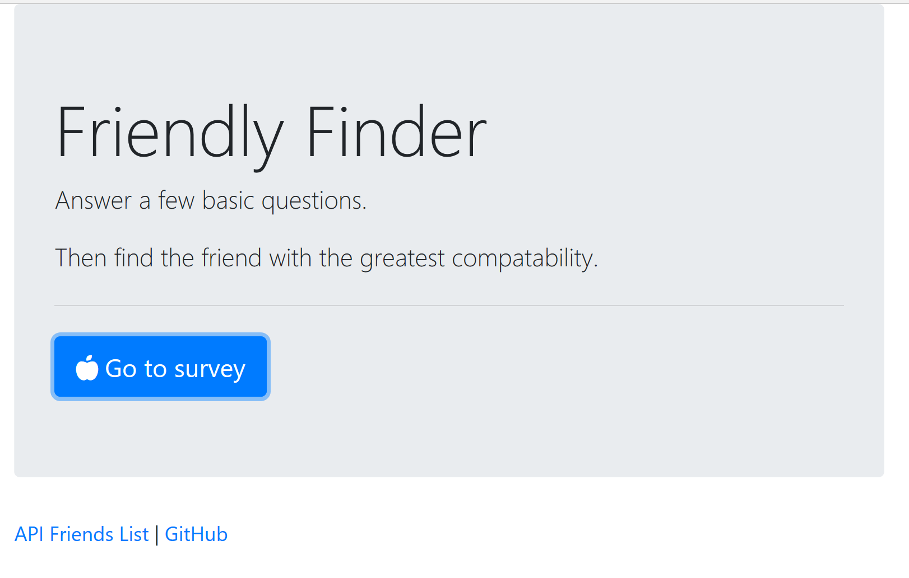
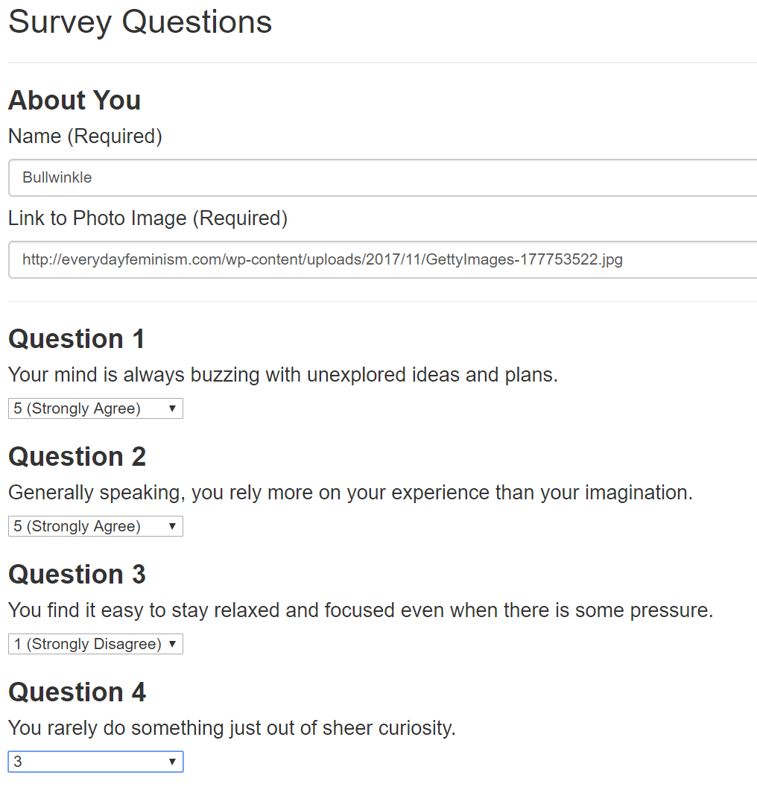

# FriendlyFinder

## About:

Friendly finder is a full-stack dating application which prompts the user for pertinant questions concerning his or her personality and attempts to match the user with the most appropriate match. The app will then display the name and picture of the user with the best overall match. That application uses Express to handle routing. The application is also deployed on Heroku so other users can fill it out.


## Application UI

Here is the intial screenshot of the application. Clicking on the "Go to Survey" button takes the user to the dating survey where he/she will be able to enter questions about their personality, as well as posting an image of themselves (required). The links listed in the footer takes the user either to view the lists of all entries(people) in the database, displayed in  raw format. The other GitHub Repo link takes the the applications GitHub location. 





<br>
<br>

The following image provides the user with a sneak preview of a few of the questions required to be filled out before a match is found. There are a total of 10 questions that need to be filled out. The questions are rather basic as you can see. 
<br>
<br>





<br>
<br>
Once the user has completed the survey the best match is found and both the name and photo of the match is displayed to the user. 

<br>
<br>


## Application structure:

The FriendFinder project is divided organized into the following format:

  ```
  FriendFinder
    - .gitignore
    - app
      - data
        - friends.js
      - public
        - home.html
        - survey.html
      - routing
        - apiRoutes.js
        - htmlRoutes.js
    - node_modules
    - package.json
    - server.js
  ```
The applicaition software is located under the app folders. The data folders contains the file called friends.js which stores the list of individuals participating in this dating site. The public folder contains the html files which represent the UI presented to the user. The home.html file is the applications home or entry screen as shown earlier. The survey.html file is responsible for displaying the survey to the user, as well as capturing the survey data and feeding that to the back end node and express packages.


The servers.js file located in the root directory is responsible for starting the node server which responds to the user input , returning the appropriate html responses. The server software uses Express to handle routing between html pages.


